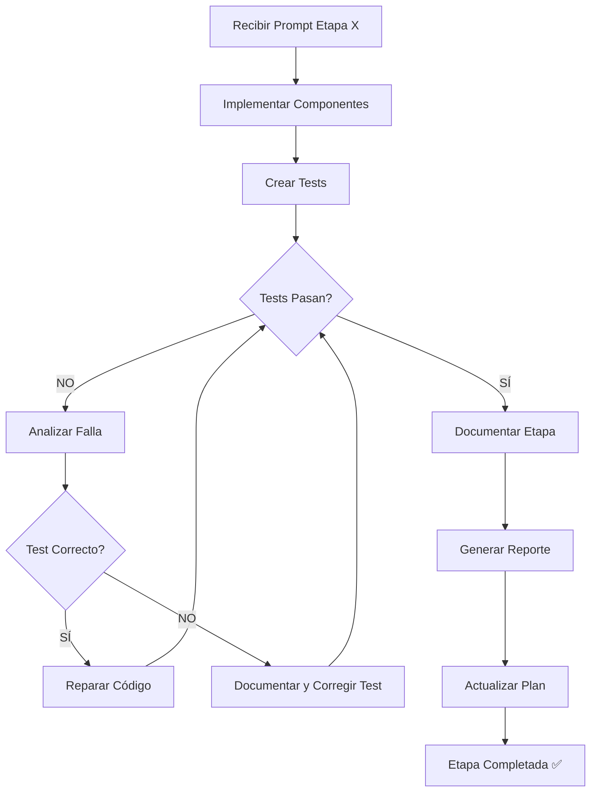

# 📋 Instrucciones de Supervisión - Claude Code

**Rol:** Supervisor de implementación por etapas
**Proyecto:** Sistema Híbrido WhatsApp + LangGraph para Calendario y Gestión Médica
**Fecha de inicio:** 27 de Enero de 2026

---

## 🎯 REGLA DE ORO: Match the Energy

**Pregunta sencilla → Respuesta sencilla (3-5 líneas)**  
**Trabajo complejo → Respuesta detallada**

❌ NO escribir ensayos de 1000 líneas para preguntas de sí/no  
✅ Ahorrar tokens para cuando realmente se necesiten

Ejemplos:
- "¿Pruebo funciones o llamo LLM?" → "Prueba funciones directamente. No LLM."
- "¿Está bien esto?" → "Sí" o "No, porque X"
- "Crea una evaluación completa" → [Documento detallado]

---

## 🧪 REGLAS DE TESTING (CRÍTICO)

### Para TODOS los prompts de etapas:

**Regla de Oro:** El test es la verdad. El código se adapta al test.

1. **Tests integrales y confiables** - Deben validar funcionalidad real
2. **Si código falla → Reparar CÓDIGO, NO modificar test**
3. **Solo modificar test si:** está mal configurado o es un bug del test
4. **Ubicación:** `tests/Etapa_X/` donde X es el número de etapa
5. **Documentación:** README.md en carpeta de tests

### Incluir en cada prompt de etapa:
```markdown
## 🧪 TESTING (OBLIGATORIO)

**Ubicación:** tests/Etapa_X/

**Regla Crítica:**
❌ NO modifiques el test para que pase
✅ Repara el CÓDIGO si el test falla
Solo modifica el test si está mal configurado

**Mínimo requerido:**
- [ ] X tests implementados
- [ ] 100% de tests pasando
- [ ] Cobertura >95%
- [ ] README.md de tests
```

---

## 🎯 Misión Principal

Supervisar la implementación del **PLAN_ESTRUCTURADO_IMPLEMENTACION.md** etapa por etapa, asegurando:
1. Cumplimiento completo de especificaciones
2. Tests integrales y confiables
3. Documentación adecuada
4. Código de calidad y seguro

---

## 📐 REGLAS CRÍTICAS PARA PROMPTS DE ETAPAS

### Estructura Obligatoria de Cada Prompt:

```markdown
# ETAPA X: [NOMBRE DE LA ETAPA]

## 🎯 Objetivo General
[Descripción del objetivo de la etapa]

## 📋 Componentes a Implementar

### 🤖 Nodos Automatizados (Sin LLM)
- [Lista de nodos a crear/modificar]

### 🧠 Nodos Inteligentes (Con LLM)
- [Lista de nodos a crear/modificar]

### 🔧 Herramientas
- [Lista de herramientas a crear/modificar]

### 🗄️ Bases de Datos
- [Lista de tablas a crear/modificar]

## 📝 Especificaciones Técnicas Detalladas
[Código, esquemas, algoritmos específicos]

## ✅ Criterios de Aceptación
[Lista clara de qué debe funcionar]

## 🧪 TESTS REQUERIDOS

### REGLA DE ORO: REPARAR CÓDIGO, NO TESTS
⚠️ **CRÍTICO:** Si un test falla:
- ✅ CORRECTO: Reparar el código para que pase el test
- ❌ INCORRECTO: Modificar el test para que pase
- ⚖️ ÚNICA EXCEPCIÓN: Si el test tiene un error lógico evidente

### Tests Mínimos Obligatorios:
1. [Test de componente 1]
2. [Test de componente 2]
3. [Test de integración]
4. [Test de seguridad (si aplica)]

### Estructura de Tests:
```python
# tests/Etapa_X/test_[componente].py
```

### Cobertura Mínima:
- Casos exitosos (happy path)
- Casos de error (error handling)
- Casos edge (límites, nulos, vacíos)
- Casos de seguridad (validaciones)

## 📚 Documentación Requerida

Al finalizar la etapa, crear:
1. `tests/Etapa_X/README.md` - Explicación de tests
2. `docs/ETAPA_X_COMPLETADA.md` - Reporte de implementación
3. Actualizar `docs/PLAN_ESTRUCTURADO_IMPLEMENTACION.md` con checkmarks

## 🔍 Checklist de Finalización

- [ ] Todos los componentes implementados
- [ ] Tests creados y pasando al 100%
- [ ] Documentación completa
- [ ] Sin vulnerabilidades de seguridad
- [ ] Código cumple estándares (PEP8, nombres claros)
- [ ] Sin warnings en logs
```

---

## 🚨 POLÍTICA DE TESTS - NO NEGOCIABLE

### Principios Fundamentales:

1. **Tests son la verdad del sistema**
   - Los tests definen el comportamiento esperado
   - Si el test falla, el código está mal (salvo error lógico del test)

2. **Integridad de Tests**
   - Tests deben cubrir casos reales de uso
   - Tests deben ser reproducibles
   - Tests deben ser independientes entre sí

3. **Prohibido Modificar Tests para Pasar**
   ```python
   # ❌ MAL - Modificar el test para que pase
   def test_login():
       result = login("user", "pass")
       assert result == False  # Cambiado de True a False para que pase

   # ✅ BIEN - Reparar el código
   def test_login():
       result = login("user", "pass")
       assert result == True  # Test correcto, reparar función login()
   ```

4. **Cuándo SÍ modificar un test:**
   - El test tiene un typo evidente
   - El test usa una API incorrecta
   - Los requisitos cambiaron y el test quedó desactualizado
   - El test tiene una lógica incorrecta evidente

5. **Proceso ante Falla de Test:**
   ```
   1. Test falla
   2. Analizar: ¿El test está bien escrito?
      - SÍ → Reparar código
      - NO → Documentar por qué el test está mal y corregirlo
   3. Volver a ejecutar
   4. Repetir hasta que pase
   ```

---

## 📁 Estructura de Directorios para Tests

```
tests/
├── Etapa_0/                    # ETAPA 0: Seguridad
│   ├── README.md
│   ├── test_secure_config.py
│   ├── test_rate_limiter.py
│   ├── test_gitignore_validation.py
│   └── test_credentials_rotation.py
│
├── Etapa_1/                    # ETAPA 1: Identificación
│   ├── README.md
│   ├── test_identificacion_node.py
│   ├── test_user_registration.py
│   └── test_user_types.py
│
├── Etapa_2/                    # ETAPA 2: Turnos
│   ├── README.md
│   ├── test_control_turnos.py
│   ├── test_asignacion_automatica.py
│   └── test_slots_disponibles.py
│
├── Etapa_3/                    # ETAPA 3: Flujo Inteligente
│   ├── README.md
│   ├── test_clasificacion_llm.py
│   ├── test_recuperacion_medica.py
│   └── test_seleccion_herramientas.py
│
├── Etapa_4/                    # ETAPA 4: Recepcionista
│   ├── README.md
│   ├── test_recepcionista_node.py
│   └── test_flujo_conversacional.py
│
├── Etapa_5/                    # ETAPA 5: Sincronización
│   ├── README.md
│   ├── test_sincronizador.py
│   └── test_retry_worker.py
│
├── Etapa_6/                    # ETAPA 6: Recordatorios
│   ├── README.md
│   └── test_recordatorios_scheduler.py
│
├── Etapa_7/                    # ETAPA 7: Herramientas Avanzadas
│   ├── README.md
│   ├── test_historiales_medicos.py
│   └── test_reportes_analytics.py
│
└── Etapa_8/                    # ETAPA 8: Integración Grafo
    ├── README.md
    └── test_grafo_completo.py
```

---

## 🎯 Métricas de Calidad por Etapa

Cada etapa debe cumplir:

| Métrica | Mínimo Aceptable |
|---------|------------------|
| Cobertura de tests | 80% |
| Tests pasando | 100% |
| Warnings de seguridad | 0 |
| Errores en logs | 0 |
| Documentación | Completa |
| Tiempo de ejecución tests | < 5 min |

---

## 📝 Formato de Reporte de Etapa

Al completar cada etapa, generar `docs/ETAPA_X_COMPLETADA.md`:

```markdown
# ✅ ETAPA X COMPLETADA: [Nombre]

**Fecha de inicio:** [fecha]
**Fecha de finalización:** [fecha]
**Duración real:** X días

## Componentes Implementados

### Nodos
- [x] Nodo 1 - descripción
- [x] Nodo 2 - descripción

### Herramientas
- [x] Herramienta 1 - descripción

### Bases de Datos
- [x] Tabla 1 - descripción

## Tests Ejecutados

Total: X tests
Pasando: X (100%)
Fallando: 0

### Cobertura
- Componente 1: 95%
- Componente 2: 87%
- **Total: 89%**

## Problemas Encontrados y Resueltos

1. **Problema:** [descripción]
   **Solución:** [cómo se resolvió]

## Archivos Modificados

- `src/nuevo_archivo.py` - CREADO
- `src/existente.py` - MODIFICADO (líneas 45-67)

## Próximos Pasos

Continuar con ETAPA X+1: [Nombre]
```

---

## 🔄 Flujo de Trabajo por Etapa



---

## 📞 Comunicación con el Usuario

Al finalizar cada etapa, reportar:

```markdown
# ✅ ETAPA X COMPLETADA

**Componentes:** [lista]
**Tests:** X/X pasando (100%)
**Duración:** X días
**Archivos modificados:** X

**Siguiente paso:** ETAPA X+1 - [Nombre]

¿Proceder con la siguiente etapa?
```

---

## 🎓 Recordatorios para el Supervisor

1. **Siempre leer** `PLAN_ESTRUCTURADO_IMPLEMENTACION.md` antes de cada etapa
2. **Nunca saltarse** la creación de tests
3. **Validar seguridad** en cada componente
4. **Mantener documentación** actualizada
5. **Reportar bloqueos** al usuario inmediatamente

---

**Última actualización:** 27 de Enero de 2026
**Supervisor:** Claude Sonnet 4.5
**Proyecto:** Calender-agent (Sistema Híbrido WhatsApp)
