# 📋 Documentación del Sistema de Calendario WhatsApp

## 🗂️ Diagrama del Sistema Completo

```mermaid
graph TD
    %% Inicio del Flujo
    START((Mensaje WhatsApp)) --> N1["<b>1. Nodo Caché</b><br/>¿Sesión Activa?<br/>Rolling Window 24h"]
    
    %% Decisión de Sesión
    N1 -- "Nueva Sesión" --> N2["<b>2. Nodo Filtrado</b><br/>¿Requiere Herramientas?<br/>Detección de Intención"]
    N1 -- "Sesión Activa" --> N2
    
    %% Clasificación de Intención
    N2 -- "SÍ - Calendario" --> N3["<b>3. Recuperación Episódica</b><br/>Búsqueda en Memoria<br/>Embeddings 384D"]
    N2 -- "NO - Conversación" --> N5
    
    %% Recuperación de Contexto
    N3 --> N4["<b>4. Selección de Herramientas</b><br/>¿Qué herramienta usar?<br/>DeepSeek LLM"]
    
    %% Decisión de Herramientas
    N4 -- "Herramienta Detectada" --> N5["<b>5. Ejecución de Herramientas</b><br/>Google Calendar API<br/>+ Orquestador LLM"]
    N4 -- "Sin Herramienta" --> N5
    
    %% Ejecución y Orquestación
    N5 --> N6["<b>6. Generación de Resumen</b><br/>Auditor LLM<br/>Resumen + Preferencias"]
    
    %% Persistencia
    N6 --> N7["<b>7. Persistencia Episódica</b><br/>Guarda en Memoria<br/>Embeddings + Metadatos"]
    
    %% Cierre
    N7 --> END((Respuesta al Usuario))

    %% ============================================================
    %% BASES DE DATOS PostgreSQL Puerto 5434
    %% ============================================================
    subgraph DB["🗄️ Base de Datos PostgreSQL (puerto 5434)"]
        direction TB
        
        %% Memoria Episódica
        DB_V["📚 memoria_episodica<br/>• Conversaciones pasadas<br/>• Búsqueda por similitud<br/>• Embeddings vectoriales<br/>• Metadatos JSON"]
        
        %% Herramientas Disponibles
        DB_T["🔧 herramientas_disponibles<br/>6 herramientas activas:<br/>• crear_evento<br/>• listar_eventos<br/>• buscar_eventos<br/>• actualizar_evento<br/>• eliminar_evento<br/>• posponer_evento"]
        
        %% LangGraph Checkpointer
        DB_CK["💾 Control de Sesiones<br/>• checkpoints<br/>• checkpoint_writes<br/>• checkpoint_blobs<br/>TTL: 24 horas"]
        
        %% Auditoría
        DB_A["📊 auditoria_conversaciones<br/>• Registro de todas las charlas<br/>• Usuario, sesión, contenido<br/>• Timestamp y roles<br/>• Retención: 6 meses"]
        
        %% User Sessions
        DB_US["👥 user_sessions<br/>• Sesiones activas<br/>• Última actividad<br/>• TTL automático<br/>• Limpieza automática"]
    end

    %% ============================================================
    %% MEMORIA RAM (Se pierde al reiniciar)
    %% ============================================================
    subgraph MEM["🧠 Memoria RAM Temporal"]
        direction TB
        
        MEM_S["⚙️ Preferencias Usuario<br/>user_preferences<br/>zona horaria, horarios favoritos"]
        
        MEM_F["👤 Datos Usuario<br/>user_facts<br/>nombre, información personal"]
        
        MEM_P["🤖 Configuración Sistema<br/>procedural memory<br/>prompts, mejoras del sistema"]
    end

    %% ============================================================
    %% ESTADO ACTUAL
    %% ============================================================
    subgraph STATE["📝 Estado de Conversación Actual"]
        direction TB
        
        ST["• ID usuario y sesión<br/>• Mensajes actuales<br/>• Herramientas seleccionadas<br/>• Contexto recuperado<br/>• Últimos eventos listados<br/>• Banderas de estado<br/>• Resumen actual"]
    end

    %% ============================================================
    %% SERVICIOS EXTERNOS
    %% ============================================================
    subgraph EXT["🌐 Servicios Externos"]
        direction TB
        
        %% LLMs
        LLM1["🧠 DeepSeek API<br/>Inteligencia Artificial<br/>Temp: 0.7<br/>Timeout: 20-25s<br/>PRINCIPAL"]
        LLM2["🧠 Claude 3.5 Haiku<br/>IA de Respaldo<br/>Temp: 0.7<br/>Timeout: 15-20s<br/>BACKUP automático"]
        
        %% Google Calendar
        GCAL["📅 Google Calendar API<br/>Cuenta de Servicio<br/>Calendar ID: 92d85...<br/>Zona: America/Tijuana"]
        
        %% Embeddings
        EMB["🔤 Procesador de Texto<br/>sentence-transformers<br/>paraphrase-multilingual<br/>384 dimensiones<br/>Local (sin internet)"]
    end

    %% ============================================================
    %% CONEXIONES
    %% ============================================================
    
    %% Nodo 1: Caché
    N1 -.->|"Lee/Escribe sesiones"| DB_CK
    N1 -.->|"Verifica TTL"| DB_US
    
    %% Nodo 2: Filtrado
    N2 -.->|"Analiza intención"| LLM1
    N2 -.->|"Backup"| LLM2
    
    %% Nodo 3: Recuperación Episódica
    N3 -.->|"Búsqueda vectorial"| DB_V
    N3 -.->|"Genera embedding"| EMB
    
    %% Nodo 4: Selección de Herramientas
    N4 -.->|"Lista herramientas"| DB_T
    N4 -.->|"Decide herramienta"| LLM1
    N4 -.->|"Fallback"| LLM2
    
    %% Nodo 5: Ejecución
    N5 -.->|"Opera calendario"| GCAL
    N5 -.->|"Extrae parámetros"| LLM1
    N5 -.->|"Lee/actualiza"| ST
    
    %% Nodo 6: Generación
    N6 -.->|"Crea resumen"| LLM1
    N6 -.->|"Actualiza preferencias"| MEM_S
    N6 -.->|"Guarda datos"| MEM_F
    
    %% Nodo 7: Persistencia
    N7 -.->|"Guarda conversación"| DB_V
    N7 -.->|"Genera embedding"| EMB
    N7 -.->|"Registra auditoría"| DB_A

    %% ============================================================
    %% ESTILOS
    %% ============================================================
    classDef nodoInicio fill:#4CAF50,stroke:#2E7D32,stroke-width:3px,color:#fff
    classDef nodoDecision fill:#2196F3,stroke:#1565C0,stroke-width:3px,color:#fff
    classDef nodoEjecucion fill:#FF9800,stroke:#E65100,stroke-width:3px,color:#fff
    classDef nodoPersistencia fill:#9C27B0,stroke:#6A1B9A,stroke-width:3px,color:#fff
    classDef dbVectorial fill:#E91E63,stroke:#880E4F,stroke-width:2px,color:#fff
    classDef dbRelacional fill:#00BCD4,stroke:#006064,stroke-width:2px,color:#fff
    classDef memoriaRAM fill:#8BC34A,stroke:#558B2F,stroke-width:2px,color:#fff
    classDef servicioExterno fill:#607D8B,stroke:#37474F,stroke-width:2px,color:#fff
    
    class N1 nodoInicio
    class N2,N3,N4 nodoDecision
    class N5,N6 nodoEjecucion
    class N7 nodoPersistencia
    class DB_V dbVectorial
    class DB_T,DB_CK,DB_A,DB_US dbRelacional
    class MEM_S,MEM_F,MEM_P,ST memoriaRAM
    class LLM1,LLM2,GCAL,EMB servicioExterno
```

---

## 📖 Explicación del Sistema en Lenguaje Natural

### 🎯 ¿Qué hace este sistema?

Imagina que tienes un asistente personal muy inteligente que vive en WhatsApp y puede manejar tu calendario de Google. Este asistente puede conversar contigo de manera natural y también ayudarte a crear, buscar, modificar y eliminar eventos en tu calendario, todo desde WhatsApp.

### 🔄 ¿Cómo funciona el flujo completo?

Cuando envías un mensaje por WhatsApp, el sistema pasa por 7 pasos ordenados, como una cadena de producción:

#### **Paso 1: El Guardia de la Puerta (Nodo Caché)**
Este es como el recepcionista de un hotel. Cuando llega tu mensaje, lo primero que hace es revisar si ya te conoce y si han estado hablando recientemente (en las últimas 24 horas). Si es así, continúa la conversación donde la dejaron. Si no, comienza una nueva conversación desde cero.

#### **Paso 2: El Detective de Intenciones (Nodo Filtrado)**
Aquí es donde el sistema lee tu mensaje y trata de entender qué quieres hacer. Es como un detective que analiza las pistas en tu mensaje. ¿Quieres crear una cita? ¿Buscar un evento? ¿O simplemente estás conversando? Este paso decide si necesitas usar el calendario o solo quieres charlar.

#### **Paso 3: El Historiador (Recuperación Episódica)**
Si necesitas usar el calendario, este paso busca en la "memoria" del sistema para recordar conversaciones anteriores que podrían ser útiles. Es como un bibliotecario que busca en los archivos conversaciones similares que tuviste antes, para entender mejor el contexto.

#### **Paso 4: El Especialista (Selección de Herramientas)**
Aquí el sistema decide exactamente qué herramienta del calendario necesita usar. Es como un técnico que mira una caja de herramientas y elige el destornillador correcto para el trabajo. Puede elegir entre crear eventos, buscarlos, modificarlos, eliminarlos, postponerlos o simplemente listar lo que tienes.

#### **Paso 5: El Ejecutor (Ejecución de Herramientas)**
Este es el paso donde realmente se hace el trabajo. Si necesitas crear una cita, aquí se crea. Si quieres buscar eventos, aquí se buscan. Es como el mecánico que ya eligió la herramienta correcta y ahora la está usando para reparar tu auto.

#### **Paso 6: El Escritor (Generación de Resumen)**
Después de hacer el trabajo, este paso crea un resumen de lo que pasó y aprende de tus preferencias. Es como un secretario que toma notas de la reunión y anota tus gustos para la próxima vez.

#### **Paso 7: El Archivista (Persistencia Episódica)**
El último paso guarda toda la conversación en la memoria permanente del sistema para que pueda recordarla en el futuro. Es como poner los documentos importantes en un archivo para consultarlos después.

### 🗄️ ¿Dónde se guarda toda la información?

El sistema tiene varios lugares donde guarda información, como diferentes cajones en un escritorio:

#### **La Biblioteca Principal (memoria_episodica)**
Aquí se guardan todas las conversaciones que has tenido con el sistema. Es como un diario muy sofisticado que puede buscar conversaciones similares cuando las necesita. Utiliza una tecnología especial que convierte las palabras en números para poder encontrar temas relacionados muy rápidamente.

#### **El Catálogo de Herramientas (herramientas_disponibles)**
Este es como el manual de instrucciones del sistema. Aquí está la lista de las 6 cosas que puede hacer con tu calendario: crear eventos, listarlos, buscarlos, actualizarlos, eliminarlos y postponerlos.

#### **El Control de Sesiones**
Es como un sistema de seguridad que mantiene registro de quién está usando el sistema y cuándo. Automáticamente "olvida" las sesiones después de 24 horas de inactividad para mantener todo limpio y seguro.

#### **El Registro de Auditoría (auditoria_conversaciones)**
Es como la caja negra de un avión. Guarda un registro detallado de todas las conversaciones para poder revisar qué pasó si algo sale mal. Mantiene estos registros por 6 meses.

#### **El Control de Usuarios (user_sessions)**
Mantiene un registro de quién está activo y cuándo fue la última vez que usaron el sistema. Se limpia automáticamente para no acumular información innecesaria.

### 🧠 ¿Qué información se mantiene temporalmente?

Como la memoria de trabajo de una persona, el sistema tiene información que mantiene mientras está funcionando pero que se pierde si se reinicia:

#### **Tus Preferencias**
El sistema recuerda cosas como tu zona horaria preferida y los horarios que sueles usar para tus citas, pero solo mientras está encendido.

#### **Tu Información Personal**
Cosas como tu nombre y detalles que compartes en la conversación se mantienen en memoria temporal.

#### **Configuración del Sistema**
Las instrucciones internas de cómo debe comportarse el asistente se mantienen aquí.

### 🌐 ¿Qué servicios externos utiliza?

El sistema no funciona solo, sino que se conecta con varios servicios externos:

#### **Los Cerebros Artificiales (DeepSeek y Claude)**
Son como dos asesores muy inteligentes. DeepSeek es el principal, que entiende tu mensaje y decide qué hacer. Claude es el asistente de respaldo que entra en acción si DeepSeek no está disponible. Ambos pueden entender español perfectamente y generar respuestas naturales.

#### **Google Calendar**
Es donde realmente viven tus eventos. El sistema se conecta a tu calendario de Google usando una cuenta especial de servicio que tiene permisos para crear, leer, modificar y eliminar eventos.

#### **El Procesador de Texto**
Es un componente local (que funciona sin internet) que convierte las palabras y frases en números especiales llamados "embeddings". Esto permite al sistema entender el significado de las palabras y encontrar conversaciones similares.

### 🔄 ¿Cómo trabajan todos juntos?

Imagina que todo el sistema es como una oficina muy bien organizada:

1. **El recepcionista** (Caché) recibe tu mensaje y te identifica
2. **El detective** (Filtrado) analiza qué quieres hacer
3. **El bibliotecario** (Recuperación) busca información relevante del pasado
4. **El especialista** (Selección) decide qué herramienta usar
5. **El ejecutor** (Ejecución) hace el trabajo real en tu calendario
6. **El escritor** (Generación) crea un resumen y aprende de ti
7. **El archivista** (Persistencia) guarda todo para el futuro

Cada paso alimenta al siguiente con información útil, y todos están conectados a las bases de datos y servicios externos que necesitan para hacer su trabajo. El resultado es una conversación fluida y natural donde puedes manejar tu calendario como si estuvieras hablando con un asistente personal muy inteligente.

### 🎪 La Magia del Sistema

Lo que hace especial a este sistema es que combina:
- **Conversación natural** (hablas como con una persona)
- **Memoria a largo plazo** (recuerda conversaciones pasadas)
- **Inteligencia artificial** (entiende lo que quieres hacer)
- **Acción real** (realmente modifica tu calendario)
- **Aprendizaje continuo** (mejora con cada conversación)

Todo esto funciona las 24 horas del día, los 7 días de la semana, desde la comodidad de WhatsApp.