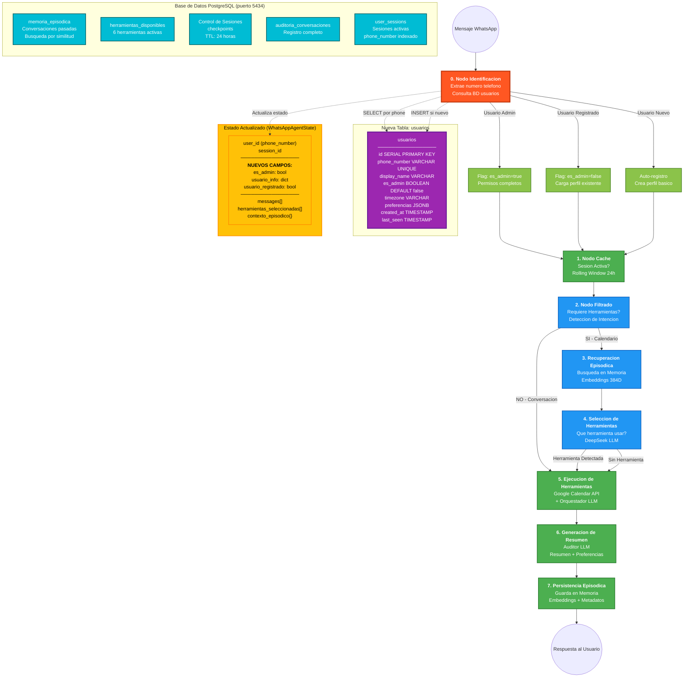

# Planificacion: Sistema de Identificacion de Usuarios

## Diagrama del Sistema Propuesto

---

## Explicacion del Sistema Propuesto

### El Problema que Resolvemos

Actualmente el sistema recibe mensajes de WhatsApp y los procesa sin saber realmente quien esta hablando. Todos los usuarios son tratados de la misma manera, sin distincion entre el administrador del sistema y los demas usuarios. Tampoco existe un registro persistente de los usuarios que han interactuado con el sistema.

Lo que necesitamos es un mecanismo que, antes de procesar cualquier mensaje, primero identifique quien esta hablando. El numero de telefono de WhatsApp sera nuestra llave principal para esto.

### Como Funciona la Identificacion

Cuando llega un mensaje de WhatsApp, este viene acompanado del numero de telefono de quien lo envia. Este numero es unico para cada persona y no cambia, lo que lo hace perfecto para identificar usuarios de manera confiable.

El nuevo nodo de identificacion funcionaria como un portero en la entrada de un edificio. Antes de dejar pasar a alguien, primero verifica su identidad. Este portero tiene una lista de residentes (la tabla de usuarios en la base de datos) y sabe quien es el dueno del edificio (el administrador).

### El Proceso Paso a Paso

Primero, cuando llega un mensaje, el sistema extrae el numero de telefono del remitente. Este numero viene en el formato que WhatsApp utiliza, que incluye el codigo de pais seguido del numero local.

Segundo, con ese numero en mano, el sistema consulta la base de datos para ver si ya conoce a esa persona. Busca en la tabla de usuarios usando el numero de telefono como identificador.

Si encuentra al usuario, carga toda su informacion: su nombre, sus preferencias, su zona horaria preferida, y muy importante, si es el administrador o no. Esta informacion se coloca en el estado del sistema para que todos los nodos siguientes puedan acceder a ella.

Si no encuentra al usuario, significa que es alguien nuevo que nunca ha hablado con el sistema. En este caso, automaticamente crea un registro basico con el numero de telefono y la fecha actual. El sistema podria pedirle su nombre en la primera interaccion para completar el perfil.

### La Distincion del Administrador

El administrador es un caso especial. Su numero de telefono estara guardado en una variable de configuracion del sistema. Cuando el nodo de identificacion detecta que el numero entrante coincide con el numero del administrador, activa una bandera especial en el estado.

Esta bandera de administrador podria usarse en el futuro para funcionalidades exclusivas: ver estadisticas del sistema, modificar configuraciones, acceder a herramientas de gestion, o recibir notificaciones especiales sobre el uso del sistema.

### La Nueva Tabla de Usuarios

La base de datos necesita una nueva tabla llamada usuarios. Esta tabla guardara toda la informacion importante de cada persona que interactue con el sistema.

El campo principal es el numero de telefono, que sera unico para cada registro. Tambien guardaremos el nombre que la persona prefiera usar, su zona horaria para calcular correctamente las fechas de los eventos, y un campo flexible de preferencias donde se pueden almacenar configuraciones personalizadas.

Un campo booleano indicara si el usuario es administrador. Por defecto sera falso, y solo el registro del administrador tendra este valor en verdadero. Tambien se guardaran las fechas de creacion del registro y de la ultima vez que el usuario interactuo con el sistema.

### Cambios en el Estado del Sistema

El estado que fluye a traves del grafo necesita tres nuevos campos. El primero es un indicador booleano que dice si el usuario actual es el administrador. El segundo es un diccionario con toda la informacion del usuario cargada de la base de datos. El tercero es otro indicador que dice si el usuario ya estaba registrado o si acaba de ser creado automaticamente.

Estos campos estaran disponibles para todos los nodos siguientes, lo que permite personalizar el comportamiento del sistema segun quien este hablando.

### Integracion con el Flujo Existente

El nodo de identificacion se inserta al principio del flujo, antes del nodo de cache. Esto garantiza que siempre sepamos quien esta hablando antes de procesar cualquier cosa.

El nodo de cache y todos los demas continuan funcionando igual que antes, pero ahora tienen acceso a informacion adicional sobre el usuario. Por ejemplo, el nodo de recuperacion episodica podria filtrar las memorias solo por las conversaciones de ese usuario especifico. El nodo de generacion de resumen podria personalizar el tono de las respuestas segun las preferencias guardadas.

### Beneficios de Este Enfoque

Esta arquitectura sigue las mejores practicas de LangGraph para sistemas multiusuario. Usa el numero de telefono como identificador natural, aprovechando lo que WhatsApp ya proporciona. No requiere que los usuarios se registren manualmente ni recuerden credenciales.

La separacion en un nodo dedicado hace el codigo mas limpio y facil de mantener. Si en el futuro se necesita cambiar la logica de identificacion, solo se modifica este nodo sin afectar al resto del sistema.

El auto-registro elimina friccion para usuarios nuevos. Pueden empezar a usar el sistema inmediatamente sin pasos adicionales, y su perfil se va completando con el tiempo a medida que interactuan.

### Consideraciones para la Implementacion

La variable con el numero del administrador deberia guardarse en las variables de entorno del sistema, no directamente en el codigo. Esto permite cambiar el administrador sin tener que modificar archivos de codigo.

Las consultas a la base de datos deben ser eficientes ya que se ejecutaran en cada mensaje. El indice en el campo de numero de telefono garantiza busquedas rapidas incluso con miles de usuarios.

El campo de preferencias usa formato JSON, lo que permite agregar nuevas configuraciones en el futuro sin modificar la estructura de la tabla. Esto da flexibilidad para evolucionar el sistema.
