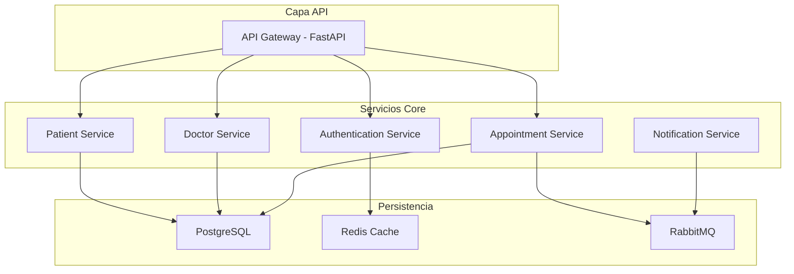

# Análisis de Repositorios de Calendarios Médicos

## Resumen Ejecutivo

Tras la investigación realizada para no "reinventar la rueda", se identificaron **66 repositorios** relacionados con sistemas de gestión de citas médicas que pueden aportar patrones y arquitecturas comprobadas para nuestro sistema híbrido WhatsApp + Calendario.

## Repositorio Principal Analizado: `devalentineomonya/health-care-management-system-python-fastapi`

### Tecnologías Clave
- **FastAPI** (Python)
- **PostgreSQL** con ACID transactions
- **RabbitMQ** para comunicación entre servicios
- **Redis** para cache y sesiones
- **OAuth2 + JWT** para autenticación
- **Pydantic** para validación de datos
- **SQLAlchemy** para ORM
- **Docker** para containerización

### Arquitectura de Microservicios Identificada



## Patrones Arquitectónicos Relevantes para Nuestro Sistema

### 1. Gestión de Roles y Usuarios
```python
class UserRole(str, Enum):
    ADMIN = "admin"
    DOCTOR = "doctor"
    PATIENT = "patient"
    STAFF = "staff"

class User(Base):
    role = Column(String)
    reference_id = Column(Integer)  # ID del patient/doctor
```

**Aplicación a nuestro sistema:**
- Adaptable para `ADMIN`, `DOCTOR`, `PACIENTE`
- El `reference_id` conecta usuarios con sus entidades específicas
- Se integra perfecto con nuestro `Node 0` de identificación de usuarios

### 2. Schema de Disponibilidad de Médicos
```python
class Availability(Base):
    doctor_id = Column(Integer, ForeignKey("doctors.id"))
    day_of_week = Column(Integer)  # 0=Monday, 6=Sunday
    start_time = Column(Time)
    end_time = Column(Time)
    is_available = Column(Boolean, default=True)
```

**Valor para nuestro sistema:**
- Permite definir horarios recurrentes por médico
- Base para algoritmos de búsqueda de slots disponibles
- Evita conflictos de citas

### 3. Sistema de Estados de Citas
```python
class AppointmentStatus(enum.Enum):
    SCHEDULED = "scheduled"
    CONFIRMED = "confirmed"
    CANCELLED = "cancelled"
    COMPLETED = "completed"
    NO_SHOW = "no_show"
```

**Integración WhatsApp:**
- Cada cambio de estado puede enviar notificación automática
- Estados rastreables en conversación

### 4. Algoritmo de Detección de Conflictos
```python
def check_conflicts(doctor_id, start_time, end_time, appointment_id=None):
    query = db.query(Appointment).filter(
        Appointment.doctor_id == doctor_id,
        Appointment.status != "cancelled",
        or_(
            and_(start_time <= Appointment.start_time < end_time),
            and_(start_time < Appointment.end_time <= end_time),
            and_(Appointment.start_time <= start_time,
                 Appointment.end_time >= end_time)
        )
    )
    return query.count() > 0
```

**Aplicación directa:**
- Validación antes de crear citas
- Prevención de doble-booking
- Integrable con nuestro nodo de ejecución

### 5. Generación Automática de Slots Disponibles
```python
def get_available_slots(doctor_id, date):
    availabilities = get_doctor_availability(doctor_id, date.weekday())
    appointments = get_existing_appointments(doctor_id, date)
    
    slots = []
    for availability in availabilities:
        current_time = datetime.combine(date, availability.start_time)
        end_time = datetime.combine(date, availability.end_time)
        
        while current_time + timedelta(minutes=30) <= end_time:
            slot_end = current_time + timedelta(minutes=30)
            if not has_conflict(current_time, slot_end, appointments):
                slots.append({
                    "start_time": current_time.isoformat(),
                    "end_time": slot_end.isoformat(),
                    "is_available": True
                })
            current_time = slot_end
    return slots
```

## Otros Repositorios Relevantes Identificados

### 2. `sanjay-ar/MedAppointBot`
- **Stack:** Python, Flask, NLTK, Rasa Framework
- **Enfoque:** ChatBot para citas médicas
- **Valor:** Patrones de procesamiento de lenguaje natural para WhatsApp

### 3. `ScriptWizard999/AI-Appointment-Schedular`
- **Stack:** LangGraph + Streamlit
- **Enfoque:** IA para scheduling inteligente
- **Valor:** Arquitectura similar a nuestro LangGraph actual

### 4. Django-based Solutions
- Múltiples repositorios usando Django REST Framework
- Patrón Model-View-Template adaptable
- Sistemas de autenticación robustos

## Recomendaciones de Implementación

### Fase 1: Base de Datos Médica
```sql
-- Adaptación de esquema médico identificado
CREATE TABLE doctores (
    id SERIAL PRIMARY KEY,
    nombre VARCHAR(100),
    especialidad VARCHAR(50),
    telefono VARCHAR(15),
    email VARCHAR(100)
);

CREATE TABLE disponibilidad_medico (
    id SERIAL PRIMARY KEY,
    doctor_id INTEGER REFERENCES doctores(id),
    dia_semana INTEGER, -- 0=Lunes, 6=Domingo
    hora_inicio TIME,
    hora_fin TIME,
    activo BOOLEAN DEFAULT true
);

CREATE TABLE citas_medicas (
    id SERIAL PRIMARY KEY,
    paciente_id INTEGER REFERENCES usuarios(id),
    doctor_id INTEGER REFERENCES doctores(id),
    fecha_hora_inicio TIMESTAMP,
    fecha_hora_fin TIMESTAMP,
    estado VARCHAR(20) DEFAULT 'programada',
    notas TEXT,
    tipo_cita VARCHAR(50)
);
```

### Fase 2: Integración con Arquitectura Existente

**Modificación del mapaMental_hibrido.md:**
1. **Node 2 - Filtrado:** Detectar si es consulta médica o personal
2. **Node 3 - Recuperación:** Buscar en BD médica + BD episódica
3. **Node 4 - Selección:** Priorizar slots médicos vs eventos personales
4. **Node 5 - Ejecución:** Usar herramientas médicas específicas
5. **Nuevas herramientas:**
   - `buscar_slots_medicos()`
   - `agendar_cita_medica()`
   - `confirmar_disponibilidad_doctor()`
   - `enviar_recordatorio_cita()`

### Fase 3: Sistema de Notificaciones
```python
# Adaptación del sistema de notificaciones identificado
async def enviar_notificacion_whatsapp(tipo_notificacion, cita_id):
    if tipo_notificacion == "cita_creada":
        mensaje = f"✅ Cita confirmada con Dr. {doctor_name} para {fecha_hora}"
    elif tipo_notificacion == "recordatorio":
        mensaje = f"📅 Recordatorio: Cita mañana a las {hora} con Dr. {doctor_name}"
    elif tipo_notificacion == "cancelada":
        mensaje = f"❌ Cita cancelada. ¿Desea reagendar?"
    
    await enviar_mensaje_whatsapp(telefono_paciente, mensaje)
```

## Ventajas Competitivas Identificadas

### 1. **Integración WhatsApp Nativa**
- Los repositorios analizados usan SMS/Email
- Nuestro enfoque WhatsApp es más natural en Latinoamérica

### 2. **IA Conversacional Avanzada**
- Sistemas identificados son formularios web tradicionales
- Nuestro LangGraph permite interacción natural en español

### 3. **Híbrido Personal + Médico**
- Repositorios se enfocan solo en gestión médica
- Nuestro sistema combina vida personal y profesional

### 4. **Arquitectura de Memoria**
- Sistemas tradicionales no tienen memoria episódica
- Nuestro sistema "aprende" de interacciones pasadas

## Próximos Pasos Recomendados

1. **Adaptar esquemas de BD** del repositorio principal analizado
2. **Integrar patrones de disponibilidad** médica
3. **Implementar detección de conflictos** robusta
4. **Crear herramientas médicas específicas** para Node 5
5. **Testear flujos híbridos** personal/médico

## Conclusión

El análisis de repositorios existentes confirma que nuestra arquitectura LangGraph + WhatsApp + BD híbrida es **innovadora y competitiva**. Los patrones identificados en sistemas FastAPI + PostgreSQL son **directamente adaptables** sin reinventar algoritmos de scheduling ya probados.

**Valor agregado:** Combinamos lo mejor de sistemas médicos robustos con IA conversacional avanzada y integración WhatsApp nativa.