# 📋 Sistema Híbrido: Calendario Personal + Gestión Médica

## 🗂️ Diagrama del Sistema Completo Bifurcado

```mermaid
graph TD
    START((Mensaje WhatsApp)) --> N0["<b>0. Identificación Usuario</b><br/>Extrae número teléfono<br/>Consulta BD usuarios<br/>Determina permisos"]
    
    N0 --> N1["<b>1. Nodo Caché</b><br/>Sesión Activa<br/>TTL 24h por user_id<br/>Filtro automático FK"]
    
    N1 --> N2["<b>2. Filtrado Inteligente</b><br/>Clasificación de Solicitud<br/>Personal vs Médica vs Chat"]

    N2 --"Calendario Personal<br/>eventos propios"--> N3A["<b>3A. Recuperación Personal</b><br/>Búsqueda en Memoria<br/>pgvector user_id filter<br/>Contexto individual"]
    
    N3A --> N4A["<b>4A. Herramientas Calendario</b><br/>6 tools Google Calendar<br/>ExtendedProperties user_id<br/>Filtro automático seguridad"]
    
    N4A --> N5A["<b>5A. Ejecución Personal</b><br/>Google Calendar API<br/>CRUD eventos personales<br/>Orquestador LLM"]
    
    N5A --> N6A["<b>6A. Resumen Personal</b><br/>Auditor LLM individual<br/>Preferencias contexto<br/>Respuesta personalizada"]
    
    N6A --> N7A["<b>7A. Persistencia Personal</b><br/>memoria_episodica<br/>user_id embeddings<br/>Metadatos personales"]

    N2 --"Gestión Médica<br/>pacientes del doctor"--> N3B["<b>3B. Recuperación Médica</b><br/>BD citas_medicas<br/>JOIN con pacientes<br/>WHERE doctor_id user_id"]
    
    N3B --> N4B["<b>4B. Herramientas Médicas</b><br/>8 tools BD clínicas<br/>CRUD pacientes citas<br/>Validaciones médicas"]
    
    N4B --> N5B["<b>5B. Ejecución BD Médica</b><br/>Transacciones ACID<br/>Historiales diagnósticos<br/>Integridad relacional"]
    
    N5B --> N8["<b>8. Sincronizador Híbrido</b><br/>BD Google Calendar<br/>Worker automático<br/>Tolerancia a fallos"]
    
    N8 --> N6B["<b>6B. Resumen Médico</b><br/>LLM especializado clínico<br/>Terminología médica<br/>Protocolos HIPAA"]
    
    N6B --> N7B["<b>7B. Persistencia Médica</b><br/>Reutiliza Nodo 7A<br/>Contexto clínico<br/>Auditoría médica"]

    N2 --"Chat Simple<br/>conversación casual"--> RESP["<b>Respuesta Directa</b><br/>LLM conversacional<br/>Sin herramientas<br/>Contexto social"]

    N7A --> END((Respuesta al Usuario))
    N7B --> END
    RESP --> END

    subgraph DB["Base de Datos PostgreSQL puerto 5434"]
        direction TB
        
        DB_U["usuarios tabla principal<br/>phone_number VARCHAR PK<br/>display_name es_admin BOOLEAN<br/>tipo_usuario personal doctor<br/>especialidad num_licencia<br/>timezone preferencias JSONB<br/>created_at last_seen"]
        
        DB_V["memoria_episodica<br/>user_id VARCHAR FK usuarios phone_number<br/>resumen TEXT embedding vector 384<br/>contexto personal médico mixto<br/>metadata JSONB timestamp<br/>Indice HNSW coseno B-tree user_id"]
        
        DB_PAC["pacientes<br/>id SERIAL PK<br/>doctor_id VARCHAR FK usuarios phone_number<br/>nombre telefono UNIQUE email<br/>fecha_nacimiento genero direccion<br/>contacto_emergencia JSONB<br/>historial_medico JSONB<br/>created_at ultima_cita"]
        
        DB_CITAS["citas_medicas<br/>id SERIAL PK<br/>doctor_id VARCHAR FK usuarios phone_number<br/>paciente_id INT FK pacientes id<br/>fecha_hora TIMESTAMP duracion INT<br/>tipo_consulta estado ENUM<br/>diagnostico TEXT tratamiento JSONB<br/>google_event_id VARCHAR<br/>notas_privadas TEXT"]
        
        DB_SYNC["sincronizacion_calendar<br/>id SERIAL PK<br/>cita_id INT FK citas_medicas id<br/>google_event_id VARCHAR<br/>estado ENUM pendiente sync error<br/>ultimo_intento TIMESTAMP<br/>siguiente_reintento TIMESTAMP<br/>error_message TEXT"]
        
        DB_T["herramientas_disponibles<br/>EXISTENTES 6 Google Calendar<br/>list_calendar_events<br/>create_calendar_event<br/>update delete postpone_event<br/>NUEVAS 8 Gestión Médica<br/>crear_paciente buscar_paciente<br/>agendar_cita modificar_cita<br/>actualizar_historial<br/>generar_reporte_doctor"]
        
        DB_A["auditoria_conversaciones<br/>user_id VARCHAR FK usuarios phone_number<br/>session_id mensaje_tipo<br/>contenido TEXT timestamp<br/>accion_realizada JSONB<br/>ip_address user_agent<br/>Retención 6 meses"]
        
        DB_S["user_sessions<br/>phone_number VARCHAR FK usuarios phone_number<br/>thread_id last_activity<br/>messages_count session_data JSONB<br/>TTL automático 24h<br/>Limpieza por trigger"]
    end

    subgraph MEM["Memoria RAM Temporal"]
        direction TB
        
        MEM_P["Preferencias Usuario<br/>user_preferences por phone_number<br/>zona_horaria_preferida<br/>horarios_disponibles<br/>notificaciones_activadas<br/>configuracion_medica"]
        
        MEM_M["Contexto Médico Activo<br/>session_medica temporal<br/>paciente_actual_en_consulta<br/>historial_session JSONB<br/>diagnostico_temporal<br/>TTL duración conversación"]
        
        MEM_C["Cache Conversación<br/>state cache temporal<br/>ultimo_listado_eventos<br/>herramientas_seleccionadas<br/>contexto_episodico_recuperado<br/>Rolling window 10 mensajes"]
    end

    subgraph EXT["Servicios Externos Cloud"]
        direction TB
        
        LLM1["DeepSeek API<br/>Inteligencia Artificial Principal<br/>Prompts personal médico<br/>Temp 0.7 Timeout 20-25s<br/>Terminología clínica especializada<br/>Fallback automático a Claude"]
        
        LLM2["Claude 3.5 Haiku<br/>IA Respaldo Universal<br/>Temp 0.7 Timeout 15-20s<br/>Respuestas de emergencia<br/>Contexto personal médico<br/>Activación automática por timeout"]
        
        GCAL["Google Calendar API<br/>Cuenta de Servicio<br/>USO DUAL<br/>1. Eventos personales directos<br/>2. Vista visual citas médicas<br/>Calendar ID 92d85abc<br/>Timezone America Tijuana<br/>ExtendedProperties para filtrado"]
        
        EMB["Procesador Embeddings<br/>sentence-transformers local<br/>paraphrase-multilingual-MiniLM-L12-v2<br/>384 dimensiones normalizadas<br/>CPU GPU según disponibilidad<br/>Contexto médico personal"]
    end

    N0 -.->|"SELECT por phone_number"| DB_U
    N1 -.->|"WHERE user_id phone"| DB_S
    N3A -.->|"búsqueda vectorial filtrada"| DB_V
    N3A -.->|"genera embedding query"| EMB
    N4A -.->|"herramientas personales"| DB_T
    N4A -.->|"decisión LLM individual"| LLM1
    N5A -.->|"eventos personales API"| GCAL
    N5A -.->|"extrae parámetros"| LLM1
    N5A -.->|"actualiza cache"| MEM_C
    N6A -.->|"resumen personalizado"| LLM1
    N6A -.->|"actualiza preferencias"| MEM_P
    N7A -.->|"INSERT con user_id"| DB_V
    N7A -.->|"embedding del resumen"| EMB
    N7A -.->|"registro auditoría"| DB_A

    N3B -.->|"JOIN doctor_id"| DB_PAC
    N3B -.->|"WHERE doctor_id"| DB_CITAS
    N4B -.->|"herramientas médicas"| DB_T
    N4B -.->|"contexto clínico LLM"| LLM1
    N5B -.->|"CRUD transaccional"| DB_CITAS
    N5B -.->|"UPDATE historial"| DB_PAC
    N5B -.->|"contexto temporal"| MEM_M
    N8 -.->|"INSERT sincronización"| DB_SYNC
    N8 -.->|"CREATE event médico"| GCAL
    N6B -.->|"terminología médica"| LLM1
    N6B -.->|"especialización clínica"| LLM2
    N7B -.->|"memoria médica"| DB_V
    N7B -.->|"auditoría HIPAA"| DB_A

    RESP -.->|"conversación casual"| LLM1
    RESP -.->|"backup conversacional"| LLM2

    classDef nodoOriginal fill:#2196F3,stroke:#1565C0,stroke-width:3px,color:#fff
    classDef nodoReutilizable fill:#FFC107,stroke:#FF8F00,stroke-width:3px,color:#000
    classDef nodoNuevo fill:#4CAF50,stroke:#2E7D32,stroke-width:3px,color:#fff
    classDef dbExistente fill:#00BCD4,stroke:#006064,stroke-width:2px,color:#fff
    classDef dbNueva fill:#E91E63,stroke:#880E4F,stroke-width:2px,color:#fff
    classDef servicioExterno fill:#607D8B,stroke:#37474F,stroke-width:2px,color:#fff
    classDef memoriaRAM fill:#8BC34A,stroke:#558B2F,stroke-width:2px,color:#fff
    
    class N1,N3A,N4A,N5A,N6A nodoOriginal
    class N7A nodoReutilizable
    class N0,N2,N3B,N4B,N5B,N6B,N7B,N8,RESP nodoNuevo
    class DB_V,DB_T,DB_A,DB_S dbExistente
    class DB_U,DB_CITAS,DB_PAC,DB_SYNC dbNueva
    class LLM1,LLM2,GCAL,EMB servicioExterno
    class MEM_P,MEM_M,MEM_C memoriaRAM
```

---

## 📖 Explicación del Sistema Híbrido en Lenguaje Natural

### 🎯 ¿Qué hace este sistema mejorado?

Imagina que tienes un asistente personal súper inteligente que no solo maneja tu calendario personal, sino que también puede funcionar como un sistema completo de gestión médica para doctores. Es como tener dos asistentes especializados en uno: un secretario personal para tus eventos privados y un asistente médico para gestionar pacientes y citas profesionales.

### 🔀 ¿Cómo funciona la bifurcación inteligente?

Cuando envías un mensaje por WhatsApp, el sistema es lo suficientemente inteligente para entender qué tipo de ayuda necesitas:

#### **El Portero Inteligente (Identificación de Usuario)**
Antes que nada, el sistema identifica quién eres usando tu número de teléfono. Es como mostrar tu identificación en la entrada de un edificio. El sistema consulta su base de datos para saber si eres un usuario regular, un doctor, o el administrador del sistema.

#### **El Director de Tráfico (Filtrado Inteligente)**
Una vez que sabe quién eres, analiza tu mensaje para decidir hacia dónde dirigirte:
- Si hablas de "mi cita del viernes" → Flujo Personal (tu calendario privado)
- Si dices "el paciente Juan necesita consulta" → Flujo Médico (gestión profesional)
- Si solo saludas o conversas → Chat Simple (plática casual)

### 🟢 Flujo Personal: Tu Calendario Privado

Este es el sistema original que ya conoces, pero mejorado con identificación de usuario:

#### **Tu Memoria Personal**
El sistema recuerda todas tus conversaciones anteriores, pero solo las tuyas. Es como tener un diario personal que solo tú puedes leer. Usa tu número de teléfono como llave para asegurarse de que nunca veas información de otras personas.

#### **Tus Herramientas Personales**
Tienes acceso a 6 herramientas para manejar tu calendario de Google:
- Crear eventos personales
- Ver tus próximas citas
- Buscar eventos específicos
- Modificar o cancelar citas
- Reprogramar cuando sea necesario

#### **Tu Google Calendar**
Todos tus eventos se crean con una etiqueta invisible que dice "este evento pertenece a [tu número]", así el sistema siempre sabe qué eventos son tuyos.

### 🟣 Flujo Médico: Gestión Profesional de Pacientes

Esta es la nueva funcionalidad para doctores que transforma el sistema en una clínica digital:

#### **Base de Datos Médica Completa**
En lugar de depender solo de Google Calendar, el sistema tiene su propia base de datos médica con:
- **Registro de Pacientes**: Nombres, teléfonos, historiales médicos completos
- **Citas Médicas**: Fechas, diagnósticos, tratamientos, notas privadas
- **Sincronización**: Automáticamente refleja las citas en Google Calendar para vista visual

#### **Herramientas Médicas Especializadas**
Los doctores tienen acceso a 8 herramientas médicas adicionales:
- Registrar nuevos pacientes
- Buscar historial médico de pacientes existentes
- Agendar citas con validaciones médicas
- Actualizar diagnósticos y tratamientos
- Generar reportes de seguimiento
- Modificar o cancelar citas profesionales

#### **El Sincronizador Mágico**
Aquí está la innovación principal: cuando el doctor crea una cita médica, esta se guarda primero en la base de datos médica (que es la fuente de verdad), y después un proceso automático la sincroniza con Google Calendar para que el doctor pueda verla visualmente. Si Google Calendar falla, el sistema médico sigue funcionando perfectamente.

### 🔄 ¿Cómo funciona la arquitectura híbrida?

#### **Dos Calendarios en Uno**
- **Google Calendar Personal**: El doctor crea sus eventos personales directamente aquí
- **Google Calendar Médico**: Se sincroniza automáticamente desde la base de datos médica

#### **Seguridad Automática Multinivel**
1. **Por Usuario**: Cada persona solo ve su propia información
2. **Por Tipo**: Los pacientes no pueden acceder a herramientas médicas
3. **Por Doctor**: Cada doctor solo ve sus propios pacientes
4. **Por Contexto**: La información personal y médica se mantiene separada

### 🗄️ ¿Dónde se almacena toda esta información?

#### **Base de Datos Relacional Inteligente**
Todo está conectado como una red familiar:
- **Usuarios** (la tabla principal con números de teléfono)
- **Pacientes** (conectados a su doctor específico)
- **Citas Médicas** (conectadas al doctor y al paciente)
- **Memoria de Conversaciones** (separada por usuario)
- **Sincronización** (control automático de Google Calendar)

#### **Memoria Temporal Especializada**
- **Contexto Personal**: Tus preferencias de horarios y zona horaria
- **Contexto Médico**: Información del paciente que se está atendiendo
- **Cache de Conversación**: Los últimos mensajes para mantener el contexto

### 🌐 ¿Qué servicios externos utiliza?

#### **Inteligencia Artificial Especializada**
- **DeepSeek**: El cerebro principal que entiende tanto lenguaje casual como terminología médica
- **Claude**: El respaldo que entra en acción si DeepSeek está ocupado
- Ambos están entrenados para manejar tanto conversaciones personales como profesionales médicas

#### **Google Calendar Dual**
- **Uso Personal**: Eventos directos como antes
- **Uso Médico**: Vista sincronizada de la base de datos médica
- **Filtrado Automático**: Cada usuario solo ve sus propios eventos

### 🔄 ¿Cómo trabajan todos juntos en el sistema híbrido?

Imagina una clínica moderna con dos secciones:

1. **Área Personal**: Donde manejas tu agenda privada (lado derecho del cerebro)
2. **Área Profesional**: Donde atiendes pacientes y gestionas la clínica (lado izquierdo del cerebro)
3. **Recepción Central**: Que decide hacia dónde dirigir cada conversación

El sistema automáticamente cambia entre estos modos según lo que necesites, pero siempre manteniendo toda la información segura y separada.

### 🎪 La Magia del Sistema Híbrido

Lo que hace especial a esta nueva arquitectura es que combina:
- **Uso Personal y Profesional** en un solo asistente
- **Seguridad Automática** sin que tengas que preocuparte
- **Inteligencia Contextual** que entiende cuándo hablas como persona vs. como doctor
- **Sincronización Perfecta** entre base de datos médica y vista visual
- **Tolerancia a Fallos** - si Google falla, la clínica sigue funcionando
- **Escalabilidad** - puede manejar desde un doctor hasta una clínica completa

Todo esto funciona las 24 horas del día, los 7 días de la semana, desde WhatsApp, convirtiendo tu teléfono en una clínica digital completa sin perder la simplicidad de un asistente personal.