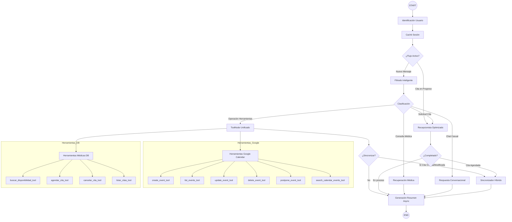

# Arquitectura del Sistema: Nodos y Herramientas (Etapa 8)

## Workflow Jerárquico (Mermaid)

## Inventario de Componentes

### 1. Nodos del Grafo (8 Principales)
- **N0: Identificación Usuario**: Valida la identidad del usuario y rol (paciente/doctor/admin) al inicio.
- **N1: Caché Sesión**: Gestiona la persistencia temporal (24h) y detecta expiraciones.
- **N2: Filtrado Inteligente**: Clasificador LLM (DeepSeek/Claude) que determina la intención del mensaje.
- **N3: Recuperación Médica**: Motor de búsqueda SQL + Semántica (Embeddings) para consultas de doctores.
- **N4: ToolNode Unificado**: Contenedor de ejecución para herramientas externas y de base de datos.
- **N5: Recepcionista Optimizado**: Flujo de agendamiento con slot filling (fecha, hora, paciente).
- **N6: Respuesta Conversacional**: Generador de respuestas amigables para chat casual.
- **N7: Sincronizador Híbrido**: Sincroniza cambios locales en tiempo real con Google Calendar.
- **N8: Generación Resumen Async**: Persistencia de sesión y generación de auditoría en segundo plano.

### 2. Herramientas (Toolbox)

#### Categoría: Google Calendar
- `create_event_tool`: Crea eventos en el calendario de Google.
- `list_events_tool`: Lista todos los eventos futuros.
- `update_event_tool`: Modifica eventos existentes.
- `delete_event_tool`: Elimina eventos mediante ID.
- `postpone_event_tool`: Pospone eventos a una nueva fecha/hora.
- `search_calendar_events_tool`: Búsqueda avanzada de eventos.

#### Categoría: Médicas (Database)
- `buscar_disponibilidad_tool`: Busca slots libres en la agenda médica local.
- `agendar_cita_tool`: Registra una nueva cita médica en PostgreSQL.
- `cancelar_cita_tool`: Marca citas como canceladas.
- `listar_citas_tool`: Recupera el listado de citas para un doctor o paciente.

### 3. Funciones de Decisión (Workflow)
1. **Decisión Temprana**: Salta la clasificación LLM si el usuario ya está en medio de un proceso de agendamiento.
2. **Decisión 1 (Clasificación)**: Enruta el mensaje según la intención detectada (Cita, Médica, Herramientas o Chat).
3. **Decisión 2 (Post-Tools)**: Envía al sincronizador solo si se modificaron datos sensibles de citas.
4. **Decisión 3 (Post-Recepcionista)**: Sincroniza con Calendar solo después de confirmar y completar una cita.
